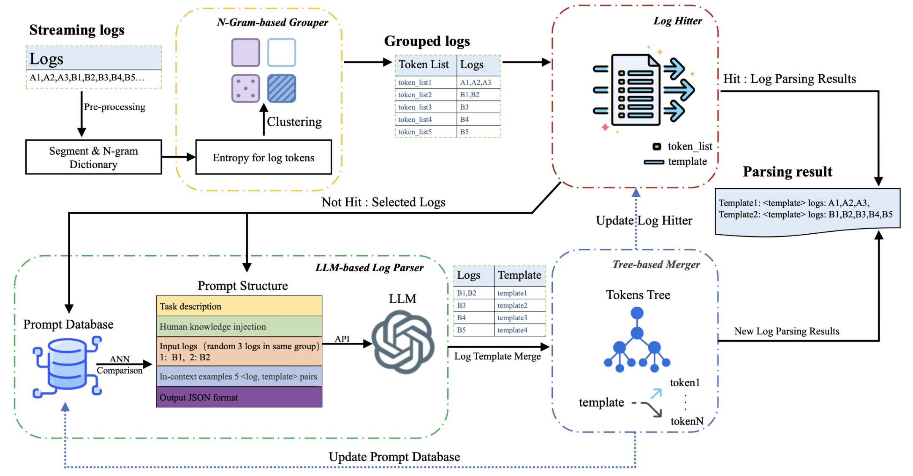

# Self-Evolutionary Group-wise Log Parsing Based on Large Language Model
In this paper we propose self-evolving method called SelfLog，which, on one hand, uses similar <group, template> pairs extracted by LLM itself in the historical data to act as the prompt of a new log, allowing the model to learn in a self-evolution and labeling-free way. On the other hand, we propose an N-Gram-based grouper and log hitter.

## Repository Organization

```
├── evaluate/ # 
│   ├── evaluator/ # the evaluation code of GA, PA, PTA, RTA
│   └── evaluator_PA/ # calculate PA, PTA, RTA result
├── functions/ # mian part of SelfLog
│   ├── benchmark_settings/ # log data process
│   ├── gram/ # N-gram based grouper
│   ├── llm_func/ # requst llm
│   └── tree_based_merge/ # the postprocess of SelfLog
├── logs/
│   └── ...... # parsing log files
├── online_selfLog/ # online version of SelfLog
│   ├── is_new_log # log hitter
│   ├── log_pruduce # streaming log production
│   └── online_run # test the efficient of SelfLog 
├── PSQL/ # Prompt database recall method based on PostgreSQL
│   ├── model # the embedding model of SelfLog
│   ├── conConfig # connect psql setting
│   ├── exampleToPSQL # algorithm startup candidate set written to psql
│   └── findTopKexam # recall examples
├── CONSTANT # hyperparameter configuration items
├── llmAPIsetting # llm address url and key
├── prompt # llm prompt format
├── run.py # test the effect of SelfLog on the dataset 
└── README.md
```

## Quick start
### Preparation
#### Environment Installation
* Prompt Database
We use psql with the vector plugin to implement a method for retrieving and recalling related logs based on semantic similarity. You can also use other databases for your purposes.
> 1. Install PostgresSQL
> 2. Creat table
```
such as
CREATE TABLE IF NOT EXISTS public.log_template
(
    "ID" integer NOT NULL DEFAULT nextval('id_seq'::regclass),
    log text COLLATE pg_catalog."default",
    template text COLLATE pg_catalog."default",
    "logVector" vector,
    CONSTRAINT seflog_pkey PRIMARY KEY ("ID")
);
```
* Python
> 1. Install python >= 3.8
> 2. pip install -r requirements.txt

### Set settings
* LLM API 
> 1. API-key
> 2. model url
* Candidates to prompt database
> 1. cd PSQL
> 2. python exampleToPSQL.py
* Effect evaluation
> 1. python run.py

The analysis results will be stored in the log directory. 
* Efficiency evaluation
> 1. cd online_selfLog
> 2. [download full dataset](https://zenodo.org/records/8196385/files/HDFS_v1.zip?download=1)
> 3. python log_pruduce.py


